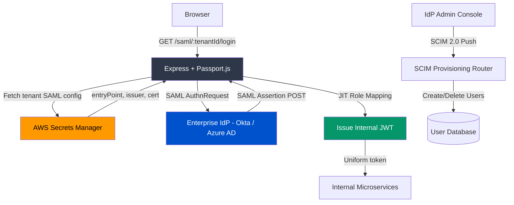

# enterprise-auth-stack

[](https://github.com/sudhanshu1402/enterprise-auth-stack/actions/workflows/ci.yml) [](LICENSE)

A B2B SSO gateway. It turns each customer's SAML 2.0 assertions into one uniform internal JWT, handles SCIM 2.0 user provisioning, and keeps tenants isolated with configs pulled from AWS Secrets Manager at runtime.

Single-process reference implementation of the wiring, not a hosted product. The user store is in-memory. Swap it for a database and point Secrets Manager at real tenant secrets to run it for real.

## The problem

Every enterprise customer brings a different IdP: Okta, Azure AD, OneLogin, each with its own certificates and attribute names. Hardcoding a config per tenant doesn't scale, and putting certificates in your codebase or database creates a rotation problem you'll regret.

So tenant SAML config is resolved from Secrets Manager per request, IdP groups map to internal roles at assertion time, and downstream services get one JWT shape and never learn what SAML is.

## Architecture


```mermaid
graph TB
    Browser[Browser] -->|GET /saml/:tenantId/login| API[Express + Passport.js]
    API -->|Fetch tenant SAML config| SM[AWS Secrets Manager]
    SM -->|entryPoint, issuer, cert| API
    API -->|SAML AuthnRequest| IdP[Enterprise IdP - Okta / Azure AD]
    IdP -->|SAML Assertion POST| API
    API -->|JIT Role Mapping| JWT[Issue Internal JWT]
    JWT -->|Uniform token| MS[Internal Microservices]

    IdP2[IdP Admin Console] -->|SCIM 2.0 Push| SCIM[SCIM Provisioning Router]
    SCIM -->|Create/Delete Users| DB[(User Database)]

    style API fill:#2d3748,color:#fff
    style SM fill:#ff9900,color:#000
    style IdP fill:#0052cc,color:#fff
    style JWT fill:#059669,color:#fff
```

Login hits `/api/auth/saml/:tenantId/login`, the tenant's config comes out of Secrets Manager, Passport builds the AuthnRequest, the IdP POSTs a signed assertion back to the callback, the signature is checked against the stored cert, groups become roles (`Admin` to `admin`, everything else `member`), and a 1h JWT is issued scoped to tenant and role.

## Three decisions worth reading

**Strategies are built per request, never cached.** A cached SAML strategy means a rotated certificate keeps failing until something evicts it. Rebuilding per request costs a Secrets Manager call and makes rotation take effect immediately. That's the right trade until the call volume actually hurts.

**JIT role mapping.** Group attributes from the assertion map to internal roles at login, so nobody provisions users by hand before their first sign-in.

**Dev fallbacks fail closed.** There's a mock IdP config for local work, and under `NODE_ENV=production` it's disabled: a missing tenant secret returns 500 instead of silently authenticating against a fake. SCIM refuses to start without `SCIM_BEARER_TOKEN` rather than defaulting to one.

## SCIM

Bearer-secured create, read, list, PATCH (activate and deactivate), and delete against the in-memory store. Duplicate `userName` returns a proper 409 with `scimType: uniqueness`.

```bash
curl -X POST http://localhost:3000/scim/v2/Users \
  -H "Authorization: Bearer $SCIM_BEARER_TOKEN" \
  -H "Content-Type: application/json" \
  -d '{"userName": "jane@corp.com", "name": {"givenName": "Jane"}, "active": true}'
```

## Run it

```bash
npm install
cp .env.example .env      # AWS_REGION, JWT keys, SCIM token
npm run dev
```

OpenAPI spec is served at `/api-docs`. Node 20 or 22.

## Tests

```bash
npm test
```

Six suites, no network and no AWS credentials (the SDK is mocked): `mapGroupsToRole` and `createTenantStrategy`, JWT claim shape, the SCIM store plus `extractActiveFromPatch` deprovision parsing, `getTenantConfig` across prod and dev fallback behaviour, and a check that the OpenAPI document matches the routes actually served.

## Deploy

```bash
docker build -t auth-stack .
docker run -e AWS_REGION=us-east-1 -e NODE_ENV=production \
  -e SCIM_BEARER_TOKEN=... -e JWT_SECRET_DEV_ONLY=... auth-stack
```

Non-root user in the image. `render.yaml` included.

## What it doesn't do

- `passport-saml` is deprecated. The move to `@node-saml/passport-saml` hasn't happened yet.
- SAML only. No OIDC, which is what most modern IdPs would rather speak.
- JWTs are signed HS256 with a shared secret. RS256 with public key distribution is the real answer.
- No Secrets Manager caching, so every login is an API call.
- No audit log of authentication events, which any compliance review will ask for first.
- SCIM is synchronous, so a 1000-user directory sync will feel it.

## Deep-dive

Full breakdown at the [System Design Portal](https://sudhanshu1402.github.io/system-design-portal/auth-stack).

## License

MIT
