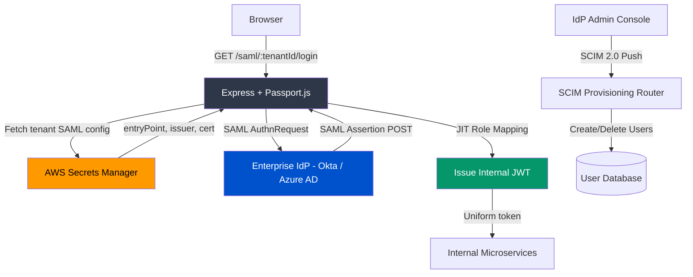

<h1>
<picture>
  <source media="(prefers-color-scheme: dark)" srcset="https://raw.githubusercontent.com/sudhanshu1402/enterprise-auth-stack/main/assets/banner-dark.svg" />
  <source media="(prefers-color-scheme: light)" srcset="https://raw.githubusercontent.com/sudhanshu1402/enterprise-auth-stack/main/assets/banner-light.svg" />
  
</picture>
</h1>

[](https://github.com/sudhanshu1402/enterprise-auth-stack/actions/workflows/ci.yml) [](LICENSE)


SAML assertions become one internal JWT, SCIM provisions users, and each tenant's IdP config comes from Secrets Manager per request so a rotated cert never sits behind a stale cache.

Single-process reference implementation, not a hosted product. The store is in-memory; swap it for a database to run this for real.

## Architecture


```mermaid
graph TB
    Browser[Browser] -->|GET /saml/:tenantId/login| API[Express + Passport.js]
    API -->|Fetch tenant SAML config| SM[AWS Secrets Manager]
    SM -->|entryPoint, issuer, cert| API
    API -->|SAML AuthnRequest| IdP[Enterprise IdP - Okta / Azure AD]
    IdP -->|SAML Assertion POST| API
    API -->|JIT Role Mapping| JWT[Issue Internal JWT]
    JWT -->|Uniform token| MS[Internal Microservices]

    IdP2[IdP Admin Console] -->|SCIM 2.0 Push| SCIM[SCIM Provisioning Router]
    SCIM -->|Create/Delete Users| DB[(User Database)]

    style API fill:#2d3748,color:#fff
    style SM fill:#ff9900,color:#000
    style IdP fill:#0052cc,color:#fff
    style JWT fill:#059669,color:#fff
```

`/api/auth/saml/:tenantId/login`: fetch config, build the AuthnRequest, verify the signed assertion, map groups to roles (`Admin` -> `admin`, else `member`), issue a 1h JWT.

## Proof it runs


Calls the real `issueInternalToken` and `mapGroupsToRole` exports directly, no server needed. `npm run assets` regenerates it from `scripts/demo-sign-verify-rotate.ts`.

## Key decisions

| Decision | Why | Trade-off |
|---|---|---|
| IdP config resolved per request | rotated cert works immediately | 2 Secrets Manager calls/login |
| JIT role mapping from `groups` | no manual provisioning pre-login | role change needs fresh login |
| Dev fallbacks fail closed in prod | never trust a mock IdP or dev key | `.env` must be set right |

Full reasoning: [docs/DESIGN.md](docs/DESIGN.md).

## SCIM

Bearer-secured CRUD + PATCH deprovision. Duplicate `userName` -> 409, `scimType: uniqueness`.

```bash
curl -X POST http://localhost:3000/scim/v2/Users \
  -H "Authorization: Bearer $SCIM_BEARER_TOKEN" \
  -H "Content-Type: application/json" \
  -d '{"userName": "jane@corp.com", "name": {"givenName": "Jane"}, "active": true}'
```

## Run it

```bash
npm install
cp .env.example .env      # AWS_REGION, JWT keys, SCIM token
npm run dev
```

OpenAPI spec at `/api-docs`.

## Tests

```bash
npm test    # 59 tests, 6 suites, no network, no AWS credentials
```

Covers role mapping, SAML resolution + replay cache, JWT claims, SCIM store + patch parsing, prod/dev fallbacks, OpenAPI-vs-routes parity.

## Deploy

```bash
docker build -t auth-stack .
docker run -e AWS_REGION=us-east-1 -e NODE_ENV=production \
  -e SCIM_BEARER_TOKEN=... -e JWT_SECRET_DEV_ONLY=... auth-stack
```

Non-root image; `render.yaml` included.

## What it doesn't do

| Gap | Real answer |
|---|---|
| Replay cache is an in-process `Map` | needs Redis for >1 replica |
| SAML only | most modern IdPs speak OIDC |
| HS256 shared secret | RS256 + public key is the real answer |
| No audit log | first thing compliance asks for |
| SCIM is synchronous | a 1000-user sync will feel it |

## Deep-dive

[System Design Portal](https://sudhanshu1402.github.io/system-design-portal/auth-stack).

## License

MIT
